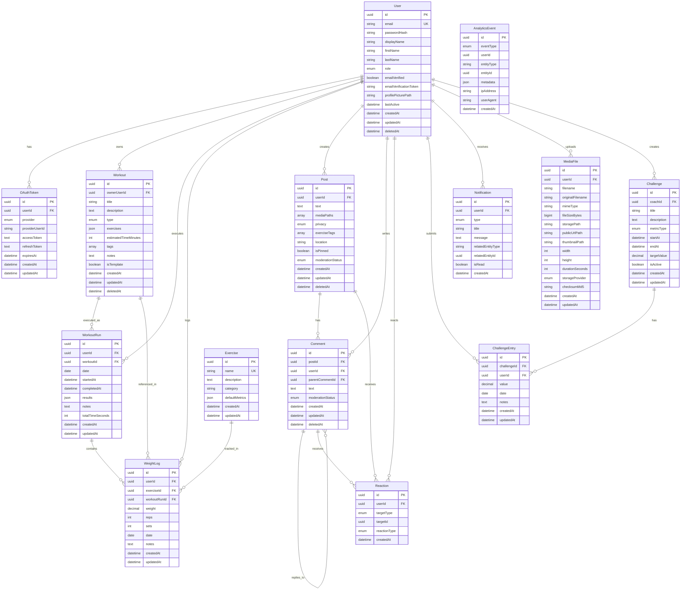

# Fitness Earley v2 - Entity Relationship Diagram

This document contains the ER diagram in Mermaid format showing all relationships between models.

## Complete ER Diagram

## Key Relationships

### One-to-Many

- User → OAuthToken (1:many)
- User → Workout (1:many)
- User → WorkoutRun (1:many)
- User → WeightLog (1:many)
- User → Post (1:many)
- User → Comment (1:many)
- User → Reaction (1:many)
- User → ChallengeEntry (1:many)
- User → Notification (1:many)
- User → MediaFile (1:many)
- User → Challenge (1:many - as coach)
- Workout → WorkoutRun (1:many)
- Workout → WeightLog (1:many)
- Exercise → WeightLog (1:many)
- WorkoutRun → WeightLog (1:many)
- Post → Comment (1:many)
- Post → Reaction (1:many)
- Comment → Comment (1:many - self-referential for nested comments)
- Comment → Reaction (1:many)
- Challenge → ChallengeEntry (1:many)

### Many-to-One

- OAuthToken → User (many:1)
- Workout → User (many:1 - owner)
- WorkoutRun → User (many:1)
- WorkoutRun → Workout (many:1)
- WeightLog → User (many:1)
- WeightLog → Exercise (many:1, optional)
- WeightLog → WorkoutRun (many:1, optional)
- Post → User (many:1)
- Comment → Post (many:1)
- Comment → User (many:1)
- Comment → Comment (many:1 - parent comment)
- Reaction → User (many:1)
- Challenge → User (many:1 - coach)
- ChallengeEntry → Challenge (many:1)
- ChallengeEntry → User (many:1)
- Notification → User (many:1)
- MediaFile → User (many:1, optional)

### Constraints

- **OAuthToken**: Unique constraint on (provider, providerUserId)
- **Reaction**: Unique constraint on (userId, targetType, targetId) - one reaction per user per target
- **ChallengeEntry**: Unique constraint on (challengeId, userId, date) - one entry per user per challenge per day
- **User.email**: Unique constraint
- **Exercise.name**: Unique constraint

### Soft Deletes

Models with soft delete support (deletedAt field):
- User
- Workout
- Post
- Comment

### Indexes

Key indexes for performance:
- User: email, role, deletedAt
- Workout: ownerUserId, type, deletedAt
- WorkoutRun: userId, workoutId, date
- WeightLog: userId, exerciseId, workoutRunId, date
- Post: userId, privacy, moderationStatus, deletedAt, createdAt
- Comment: postId, userId, parentCommentId, deletedAt
- Reaction: targetType+targetId, userId
- Challenge: coachId, isActive, startAt+endAt
- ChallengeEntry: challengeId, userId, date
- Notification: userId, isRead, createdAt
- AnalyticsEvent: eventType, userId, createdAt, entityType+entityId

